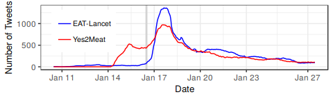
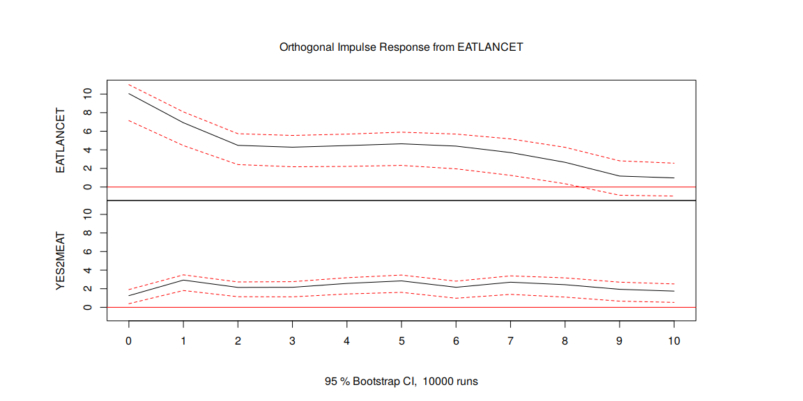
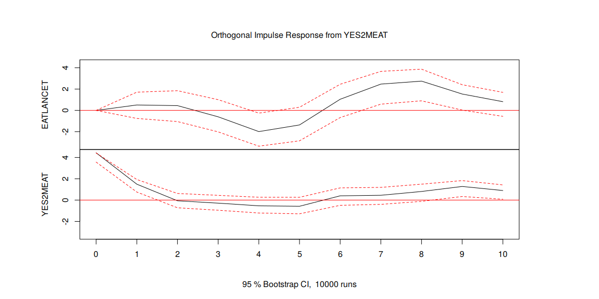

    Sys.setlocale("LC_ALL", 'en_US.UTF-8')
    library(dplyr)
    library(knitr)
    library(kableExtra)
    library(ggplot2)
    library(zoo)

    knitr::opts_chunk$set(
      echo = FALSE,
      message = FALSE,
      warning = FALSE
      )

    load("data/eatlancet_tweets.rda")
    load("data/eatlancet_botscores.rda")
    load("data/eatlancet_URLshares.rda")
    tweetids1 <- read.csv(gzfile("data/tweetids1.csv.gz"), header=F, colClasses = rep("character",2))
    tweetids2 <- read.csv(gzfile("data/tweetids2.csv.gz"), header=F, colClasses = rep("character",2))
    tweetids <- rbind(tweetids1, tweetids2)

    datasetsummary <- data.frame(
      quantity=c("tweets mentioning EAT-Lancet or yes2meat",
                 "total users",
                 "eat-lancet tweets",
                 "yes2meat tweets",
                 "mentioning both",
                 "users with both score",
                 "unique links shared",
                 "tweets with resolved links",
                 "tweets in user timelines",
                 "users with timeline",
                 "users with following list"),
      number=c(nrow(eatlancet_tweets),
               length(unique(eatlancet_tweets$USER_id_str)),
               sum(eatlancet_tweets$EATLancet),
               sum(eatlancet_tweets$yes2meat),
               sum(eatlancet_tweets$yes2meat & eatlancet_tweets$EATLancet),
               sum(!is.na(eatlancet_botscores$universalScore)),
               length(unique(eatlancet_URLshares$decodedurl)),
               nrow(eatlancet_URLshares),
               nrow(tweetids),
               length(unique(tweetids$V1)),
               4939506)) #raw follower link data cannot be publicly shared

    kable(datasetsummary, caption="Dataset summary.") %>%
      kable_styling(full_width = F)

<table class="table" style="width: auto !important; margin-left: auto; margin-right: auto;">
<caption>
Dataset summary.
</caption>
<thead>
<tr>
<th style="text-align:left;">
quantity
</th>
<th style="text-align:right;">
number
</th>
</tr>
</thead>
<tbody>
<tr>
<td style="text-align:left;">
tweets mentioning EAT-Lancet or yes2meat
</td>
<td style="text-align:right;">
15520
</td>
</tr>
<tr>
<td style="text-align:left;">
total users
</td>
<td style="text-align:right;">
4278
</td>
</tr>
<tr>
<td style="text-align:left;">
eat-lancet tweets
</td>
<td style="text-align:right;">
7281
</td>
</tr>
<tr>
<td style="text-align:left;">
yes2meat tweets
</td>
<td style="text-align:right;">
8586
</td>
</tr>
<tr>
<td style="text-align:left;">
mentioning both
</td>
<td style="text-align:right;">
347
</td>
</tr>
<tr>
<td style="text-align:left;">
users with both score
</td>
<td style="text-align:right;">
4203
</td>
</tr>
<tr>
<td style="text-align:left;">
unique links shared
</td>
<td style="text-align:right;">
2376
</td>
</tr>
<tr>
<td style="text-align:left;">
tweets with resolved links
</td>
<td style="text-align:right;">
4831
</td>
</tr>
<tr>
<td style="text-align:left;">
tweets in user timelines
</td>
<td style="text-align:right;">
8524625
</td>
</tr>
<tr>
<td style="text-align:left;">
users with timeline
</td>
<td style="text-align:right;">
4200
</td>
</tr>
<tr>
<td style="text-align:left;">
users with following list
</td>
<td style="text-align:right;">
4939506
</td>
</tr>
</tbody>
</table>
    eatlancet_tweets %>% filter(EATLancet) %>% distinct(id_str, .keep_all = T) %>% select(id=id_str, userid=USER_id_str, ts=created_at) -> EatTweetsdf 
    eatlancet_tweets %>% filter(yes2meat) %>% distinct(id_str, .keep_all = T) %>% select(id=id_str, userid=USER_id_str, ts=created_at) -> YesTweetsdf

    bins <- cut(EatTweetsdf$ts, breaks = seq(from=as.POSIXct('2019-01-10 00:00'), by = '1 hour', to=as.POSIXct('2019-01-28 00:00'))) 
    cnts <- table(bins)
    sums <- rollsum(x=cnts, k=24, align = "right")

    sdf <- as.data.frame(sums)
    sdf$date <- as.POSIXct(row.names(sdf))
    sdf$nTweets <- sdf$sums
    sdf$term <- "EAT-Lancet"
    sdf$sums <- NULL

    bins2 <- cut(YesTweetsdf$ts, breaks = seq(from=as.POSIXct('2019-01-10 00:00'), by = '1 hour', to=as.POSIXct('2019-01-28 00:00'))) 
    cnts2 <- table(bins2)
    sums2 <- rollsum(x=cnts2, k=24, align = "right")
    sdf2 <- as.data.frame(sums2)
    sdf2$date <- as.POSIXct(row.names(sdf2))
    sdf2$nTweets <- sdf2$sums
    sdf2$term <- "Yes2Meat"
    sdf2$sums2 <- NULL

    df <- rbind(sdf, sdf2)

    plt <- ggplot(data=df, aes(x=as.POSIXct(date), y=nTweets, color=term)) + geom_vline(xintercept = as.POSIXct("2019-01-16 23:55:00"), color="lightgray", lty=1, size=1) + theme_bw() + geom_line(size=0.5) + xlab("Date") + ylab("Number of Tweets") + theme_bw() + theme(legend.position = c(0.15,0.6), legend.title = element_text(size = 0), legend.text = element_text(size = 8), axis.title=element_text(size=10)) + scale_color_manual(values=c("blue","red")) + scale_x_datetime(breaks = as.POSIXct(c("2019-01-11 12:00:00", "2019-01-14 12:00:00", "2019-01-17 12:00:00", "2019-01-20 12:00:00", "2019-01-23 12:00:00", "2019-01-27 12:00:00")), labels = c("Jan 11", "Jan 14", "Jan 17", "Jan 20", "Jan 23", "Jan 27"))
    plt

    eatlancet_tweets %>% filter(EATLancet) %>% distinct(id_str, .keep_all = T) %>% select(id=id_str, userid=USER_id_str, ts=created_at) -> EatTweetsdf 
    eatlancet_tweets %>% filter(yes2meat) %>% distinct(id_str, .keep_all = T) %>% select(id=id_str, userid=USER_id_str, ts=created_at) -> YesTweetsdf 

    bins <- cut(EatTweetsdf$ts, breaks = seq(from=as.POSIXct('2018-12-01 23:00'), by = '1 hour', to=as.POSIXct('2019-04-01 02:00'))) 
    cnts <- table(bins)
    sums <- rollsum(x=cnts, k=24, align = "right")

    sdf <- as.data.frame(sums)
    sdf$date <- as.POSIXct(row.names(sdf))
    sdf$nTweets <- sdf$sums
    sdf$term <- "EAT-Lancet"
    sdf$sums <- NULL

    bins2 <- cut(YesTweetsdf$ts, breaks = seq(from=as.POSIXct('2018-12-01 23:00'), by = '1 hour', to=as.POSIXct('2019-04-01 02:00'))) 
    cnts2 <- table(bins2)
    sums2 <- rollsum(x=cnts2, k=24, align = "right")
    sdf2 <- as.data.frame(sums2)
    sdf2$date <- as.POSIXct(row.names(sdf2))
    sdf2$nTweets <- sdf2$sums
    sdf2$term <- "Yes2Meat"
    sdf2$sums2 <- NULL
        
    df <- rbind(sdf, sdf2)

    plt <- ggplot(data=df, aes(x=as.POSIXct(date), y=nTweets, color=term)) + geom_vline(xintercept = as.POSIXct("2019-01-16 23:55:00"), color="lightgray", lty=1, size=1) + theme_bw() + geom_line(size=0.5) + xlab("Date") + ylab("Number of Tweets") + theme_bw() + theme(legend.position = c(0.75,0.6), legend.title = element_text(size = 0), legend.text = element_text(size = 8), axis.title=element_text(size=10)) + scale_color_manual(values=c("blue","red")) 
    plt

    eatlancet_tweets %>% filter(EATLancet) %>% distinct(id_str, .keep_all = T) %>% select(id=id_str, userid=USER_id_str,  ts=created_at) -> EatTweetsdf 
    eatlancet_tweets %>% filter(yes2meat) %>% distinct(id_str, .keep_all = T) %>% select(id=id_str, userid=USER_id_str,  ts=created_at) -> YesTweetsdf 

    bins <- cut(EatTweetsdf$ts, breaks = seq(from=as.POSIXct('2018-12-01 23:00'), by = '1 hour', to=as.POSIXct('2019-04-01 02:00'))) 
    cnts <- table(bins)
    sums <- cumsum(x=cnts)

    sdf <- as.data.frame(sums)
    sdf$date <- as.POSIXct(row.names(sdf))
    sdf$nTweets <- sdf$sums
    sdf$term <- "EAT-Lancet"
    sdf$sums <- NULL

    bins2 <- cut(YesTweetsdf$ts, breaks = seq(from=as.POSIXct('2018-12-01 23:00'), by = '1 hour', to=as.POSIXct('2019-04-01 02:00'))) 
    cnts2 <- table(bins2)
    sums2 <- cumsum(x=cnts2)
    sdf2 <- as.data.frame(sums2)
    sdf2$date <- as.POSIXct(row.names(sdf2))
    sdf2$nTweets <- sdf2$sums
    sdf2$term <- "Yes2Meat"
    sdf2$sums2 <- NULL
        
    df <- rbind(sdf, sdf2)

    plt <- ggplot(data=df, aes(x=as.POSIXct(date), y=nTweets, color=term)) + geom_vline(xintercept = as.POSIXct("2019-01-16 23:55:00"), color="lightgray", lty=1, size=1) + theme_bw() + geom_line(size=0.5) + xlab("Date") + ylab("Number of Tweets") + theme_bw() + theme(legend.position = c(0.15,0.6), legend.title = element_text(size = 0), legend.text = element_text(size = 8), axis.title=element_text(size=10)) + scale_color_manual(values=c("blue","red")) 
    plt

    eatlancet_URLshares %>% filter (created_at>="2019-01-11" & created_at <="2019-01-27") %>% distinct(decodedurl, .keep_all = TRUE) -> df

    print(paste("tweet percent covered by annotated URLS:", round(100*sum(df$nAll[!is.na(df$class)])/sum(df$nAll), digits = 2)))

    ## [1] "tweet percent covered by annotated URLS: 65.53"

    eatlancet_URLshares %>% filter(class=="Anti") %>% select(ts=created_at, retweet_count) -> AntiTweetsdf 
    eatlancet_URLshares %>% filter(class=="Pro" | class=="Neutral") %>% select(ts=created_at, retweet_count) -> ProTweetsdf 

    ProTweetsdf$day <- as.Date(ProTweetsdf$ts)
    AntiTweetsdf$day <- as.Date(AntiTweetsdf$ts)

    ProTweetsdf %>% group_by(day) %>% summarize(n=n(), rt=sum(retweet_count)) -> Prots
    Prots$nShares <- Prots$n+Prots$rt

    AntiTweetsdf %>% group_by(day) %>% summarize(n=n(), rt=sum(retweet_count)) -> Antits
    Antits$nShares <- Antits$n+Antits$rt

    allDays <- seq(as.Date("2019-01-11"), as.Date("2019-01-27"), by="1 day")
    Prots <- left_join(data.frame(day=allDays), Prots)
    Prots$nShares[is.na(Prots$nShares)] <- 0
    Prots$n[is.na(Prots$n)] <- 0
    Antits <- left_join(data.frame(day=allDays), Antits)
    Antits$nShares[is.na(Antits$nShares)] <- 0
    Antits$n[is.na(Antits$n)] <- 0
    Antits$term <- "Against EAT-Lancet"
    Prots$term <- "In favor or neutral"

    plotdf <- rbind(Prots, Antits)
    plotdf$day <- as.POSIXct(plotdf$day)

    plt <- ggplot(data=plotdf, aes(x=as.POSIXct(day), y=n, color=term)) + geom_vline(xintercept = as.POSIXct("2019-01-16 12:00:00"), color="lightgray", lty=1, size=1) + theme_bw() + geom_line(size=0.5)+ geom_point(size=1.5) + xlab("Date") + ylab("Number of shares (log)") + theme_bw() + theme(legend.position = c(0.835,0.77), legend.title = element_text(size = 0), legend.text = element_text(size = 8)) + scale_color_manual(values=c("red", "blue"))+ scale_y_log10() + scale_x_datetime(breaks = as.POSIXct(c("2019-01-11", "2019-01-14", "2019-01-17", "2019-01-20", "2019-01-23", "2019-01-27")))

    plt

    tabledf <- data.frame(term=NULL, pro=NULL, anti=NULL)

    eatlancet_URLshares %>% filter(yes2meat) %>%
      filter(!is.na(class)) %>%  group_by(class) %>% 
        summarize(n=n()) -> meatcnts

    tabledf <- data.frame(term="yes2meat", pro=round(100*meatcnts$n[meatcnts$class=="Pro"]/sum(meatcnts$n),2), anti=round(100*meatcnts$n[meatcnts$class=="Anti"]/sum(meatcnts$n),2))

    eatlancet_URLshares %>% filter(EATLancet) %>%
     filter(!is.na(class)) %>%  group_by(class) %>% 
        summarize(n=n()) -> eatcnts

    tabledf <- rbind(tabledf, data.frame(term="EAT-Lancet", pro=round(100*eatcnts$n[eatcnts$class=="Pro"]/sum(eatcnts$n),2), anti=round(100*eatcnts$n[eatcnts$class=="Anti"]/sum(eatcnts$n),2)))

    kable(tabledf, caption="Percentage of links to anti and pro sites per term.") %>%
      kable_styling(full_width = F)

<table class="table" style="width: auto !important; margin-left: auto; margin-right: auto;">
<caption>
Percentage of links to anti and pro sites per term.
</caption>
<thead>
<tr>
<th style="text-align:left;">
term
</th>
<th style="text-align:right;">
pro
</th>
<th style="text-align:right;">
anti
</th>
</tr>
</thead>
<tbody>
<tr>
<td style="text-align:left;">
yes2meat
</td>
<td style="text-align:right;">
1.93
</td>
<td style="text-align:right;">
65.22
</td>
</tr>
<tr>
<td style="text-align:left;">
EAT-Lancet
</td>
<td style="text-align:right;">
39.19
</td>
<td style="text-align:right;">
47.60
</td>
</tr>
</tbody>
</table>
    library(vars)
    library(tseries)

    EATbins <- cut(EatTweetsdf$ts, breaks = seq(from=as.POSIXct("2019-01-17 00:00:00"), by = '1 hour', to=as.POSIXct('2019-01-27 00:00'))) 
    EATcnts <- table(EATbins)
    EATdf <- as.data.frame(EATcnts)

    YESbins <- cut(YesTweetsdf$ts, breaks = seq(from=as.POSIXct("2019-01-17 00:00:00"), by = '1 hour', to=as.POSIXct('2019-01-27 00:00'))) 
    YEScnts <- table(YESbins)
    YESdf <- as.data.frame(YEScnts)

    tsdf <- inner_join(EATdf, YESdf, by=c("EATbins"="YESbins")) 
    names(tsdf) <- c("time", "EATLANCET", "YES2MEAT")
    tsdf %>% dplyr::select(EATLANCET, YES2MEAT) -> seldf

    VARselect(seldf, season = 24)$selection

    ## AIC(n)  HQ(n)  SC(n) FPE(n) 
    ##      9      8      1      9

    varmodel <- VAR(seldf, p=9, season = 24)
    coeftest(varmodel, vcov=vcovHC(varmodel))

    ## 
    ## t test of coefficients:
    ## 
    ##                         Estimate Std. Error t value Pr(>|t|)   
    ## EATLANCET:(Intercept)   0.151497   1.381760  0.1096 0.912811   
    ## EATLANCET:EATLANCET.l1  0.674151   0.298682  2.2571 0.025147 * 
    ## EATLANCET:YES2MEAT.l1   0.114493   0.277608  0.4124 0.680493   
    ## EATLANCET:EATLANCET.l2 -0.049457   0.189676 -0.2607 0.794573   
    ## EATLANCET:YES2MEAT.l2  -0.014803   0.242724 -0.0610 0.951433   
    ## EATLANCET:EATLANCET.l3  0.163558   0.226893  0.7209 0.471886   
    ## EATLANCET:YES2MEAT.l3  -0.191694   0.299672 -0.6397 0.523156   
    ## EATLANCET:EATLANCET.l4  0.137550   0.231299  0.5947 0.552766   
    ## EATLANCET:YES2MEAT.l4  -0.298918   0.302191 -0.9892 0.323845   
    ## EATLANCET:EATLANCET.l5  0.110727   0.186625  0.5933 0.553682   
    ## EATLANCET:YES2MEAT.l5   0.066425   0.261717  0.2538 0.799922   
    ## EATLANCET:EATLANCET.l6 -0.051304   0.166997 -0.3072 0.759017   
    ## EATLANCET:YES2MEAT.l6   0.390603   0.273728  1.4270 0.155236   
    ## EATLANCET:EATLANCET.l7 -0.119594   0.246775 -0.4846 0.628501   
    ## EATLANCET:YES2MEAT.l7   0.283629   0.233961  1.2123 0.226914   
    ## EATLANCET:EATLANCET.l8 -0.148997   0.128826 -1.1566 0.248905   
    ## EATLANCET:YES2MEAT.l8   0.244853   0.272442  0.8987 0.369936   
    ## EATLANCET:EATLANCET.l9 -0.173165   0.123673 -1.4002 0.163097   
    ## EATLANCET:YES2MEAT.l9  -0.053997   0.211773 -0.2550 0.799018   
    ## EATLANCET:sd1          -2.710258   3.554261 -0.7625 0.446690   
    ## EATLANCET:sd2          -1.805739   3.951812 -0.4569 0.648239   
    ## EATLANCET:sd3          -1.352694   4.559416 -0.2967 0.767035   
    ## EATLANCET:sd4           0.127751   4.260083  0.0300 0.976108   
    ## EATLANCET:sd5          -4.914033   3.922393 -1.2528 0.211821   
    ## EATLANCET:sd6           0.047839   4.534239  0.0106 0.991593   
    ## EATLANCET:sd7           1.739159   6.920350  0.2513 0.801847   
    ## EATLANCET:sd8          -0.398550   5.500650 -0.0725 0.942316   
    ## EATLANCET:sd9           1.138244   4.021630  0.2830 0.777463   
    ## EATLANCET:sd10          9.766171   5.810852  1.6807 0.094477 . 
    ## EATLANCET:sd11          3.525129   7.060022  0.4993 0.618143   
    ## EATLANCET:sd12          1.288823   6.252914  0.2061 0.836923   
    ## EATLANCET:sd13         -0.718582   5.085209 -0.1413 0.887777   
    ## EATLANCET:sd14          0.463195   4.582851  0.1011 0.919601   
    ## EATLANCET:sd15          9.879973   6.547306  1.5090 0.132965   
    ## EATLANCET:sd16          9.527627   7.480370  1.2737 0.204340   
    ## EATLANCET:sd17         -1.081627   5.660018 -0.1911 0.848653   
    ## EATLANCET:sd18          5.442917   5.482826  0.9927 0.322115   
    ## EATLANCET:sd19          2.944332   3.865031  0.7618 0.447136   
    ## EATLANCET:sd20          1.338649   3.746877  0.3573 0.721288   
    ## EATLANCET:sd21         -0.777981   3.712883 -0.2095 0.834256   
    ## EATLANCET:sd22         -0.444824   3.551951 -0.1252 0.900472   
    ## EATLANCET:sd23         -0.730045   4.284931 -0.1704 0.864898   
    ## YES2MEAT:(Intercept)    0.674252   0.578470  1.1656 0.245254   
    ## YES2MEAT:EATLANCET.l1   0.249401   0.078332  3.1839 0.001699 **
    ## YES2MEAT:YES2MEAT.l1    0.336564   0.104121  3.2324 0.001448 **
    ## YES2MEAT:EATLANCET.l2  -0.037031   0.092343 -0.4010 0.688859   
    ## YES2MEAT:YES2MEAT.l2   -0.156699   0.104049 -1.5060 0.133735   
    ## YES2MEAT:EATLANCET.l3   0.106081   0.107802  0.9840 0.326357   
    ## YES2MEAT:YES2MEAT.l3   -0.027771   0.110000 -0.2525 0.800958   
    ## YES2MEAT:EATLANCET.l4   0.070732   0.104765  0.6752 0.500403   
    ## YES2MEAT:YES2MEAT.l4   -0.066899   0.109580 -0.6105 0.542263   
    ## YES2MEAT:EATLANCET.l5   0.063692   0.051285  1.2419 0.215800   
    ## YES2MEAT:YES2MEAT.l5    0.010369   0.100482  0.1032 0.917918   
    ## YES2MEAT:EATLANCET.l6  -0.064115   0.056745 -1.1299 0.259961   
    ## YES2MEAT:YES2MEAT.l6    0.169297   0.111642  1.5164 0.131082   
    ## YES2MEAT:EATLANCET.l7   0.060439   0.061109  0.9890 0.323910   
    ## YES2MEAT:YES2MEAT.l7   -0.025477   0.108025 -0.2358 0.813812   
    ## YES2MEAT:EATLANCET.l8  -0.029886   0.078455 -0.3809 0.703680   
    ## YES2MEAT:YES2MEAT.l8    0.104709   0.095865  1.0923 0.276111   
    ## YES2MEAT:EATLANCET.l9  -0.036345   0.094084 -0.3863 0.699704   
    ## YES2MEAT:YES2MEAT.l9    0.093575   0.071571  1.3074 0.192649   
    ## YES2MEAT:sd1            4.025906   2.589627  1.5546 0.121708   
    ## YES2MEAT:sd2           -3.989893   2.081888 -1.9165 0.056813 . 
    ## YES2MEAT:sd3            0.817095   2.390788  0.3418 0.732905   
    ## YES2MEAT:sd4            1.626801   2.523579  0.6446 0.519942   
    ## YES2MEAT:sd5           -0.149925   2.848568 -0.0526 0.958081   
    ## YES2MEAT:sd6            0.014114   2.584838  0.0055 0.995649   
    ## YES2MEAT:sd7           -3.018207   2.588827 -1.1659 0.245141   
    ## YES2MEAT:sd8           -2.090198   2.338396 -0.8939 0.372534   
    ## YES2MEAT:sd9           -0.030972   2.347904 -0.0132 0.989489   
    ## YES2MEAT:sd10          -0.151836   2.512271 -0.0604 0.951871   
    ## YES2MEAT:sd11          -1.160336   2.388071 -0.4859 0.627609   
    ## YES2MEAT:sd12           0.498192   2.604021  0.1913 0.848483   
    ## YES2MEAT:sd13           1.004105   2.577935  0.3895 0.697345   
    ## YES2MEAT:sd14           2.196595   2.251421  0.9756 0.330486   
    ## YES2MEAT:sd15           4.783771   2.792597  1.7130 0.088349 . 
    ## YES2MEAT:sd16           6.118926   2.791605  2.1919 0.029608 * 
    ## YES2MEAT:sd17           5.791913   2.707071  2.1395 0.033674 * 
    ## YES2MEAT:sd18           2.895267   2.532516  1.1432 0.254386   
    ## YES2MEAT:sd19           3.431837   2.894769  1.1855 0.237296   
    ## YES2MEAT:sd20           2.224430   2.446477  0.9092 0.364382   
    ## YES2MEAT:sd21           2.254861   2.517022  0.8958 0.371475   
    ## YES2MEAT:sd22           1.775295   2.283612  0.7774 0.437891   
    ## YES2MEAT:sd23           1.140740   2.465503  0.4627 0.644126   
    ## ---
    ## Signif. codes:  0 '***' 0.001 '**' 0.01 '*' 0.05 '.' 0.1 ' ' 1

    irfres <- irf(varmodel, cumulative=F, runs=10000)
    plot(irfres)

    seldf$EATLANCET <- log(seldf$EATLANCET+1)
    seldf$YES2MEAT <- log(seldf$YES2MEAT+1)

    VARselect(seldf, season = 24)$selection

    ## AIC(n)  HQ(n)  SC(n) FPE(n) 
    ##      9      5      3      9

    varmodel <- VAR(seldf, p=9, season=24)
    coeftest(varmodel, vcov=vcovHC(varmodel))

    ## 
    ## t test of coefficients:
    ## 
    ##                          Estimate Std. Error t value  Pr(>|t|)    
    ## EATLANCET:(Intercept)   0.0607452  0.1265177  0.4801 0.6316890    
    ## EATLANCET:EATLANCET.l1  0.3281802  0.0946873  3.4659 0.0006539 ***
    ## EATLANCET:YES2MEAT.l1   0.0502826  0.0893562  0.5627 0.5742915    
    ## EATLANCET:EATLANCET.l2  0.1790543  0.1187940  1.5073 0.1334118    
    ## EATLANCET:YES2MEAT.l2   0.0371948  0.1027403  0.3620 0.7177360    
    ## EATLANCET:EATLANCET.l3  0.1461617  0.0985941  1.4825 0.1398840    
    ## EATLANCET:YES2MEAT.l3  -0.0031896  0.1035856 -0.0308 0.9754677    
    ## EATLANCET:EATLANCET.l4 -0.0717637  0.0979413 -0.7327 0.4646358    
    ## EATLANCET:YES2MEAT.l4  -0.0040374  0.0801327 -0.0504 0.9598694    
    ## EATLANCET:EATLANCET.l5  0.1067279  0.1008546  1.0582 0.2912988    
    ## EATLANCET:YES2MEAT.l5   0.0963154  0.0834562  1.1541 0.2499233    
    ## EATLANCET:EATLANCET.l6 -0.0927840  0.0930426 -0.9972 0.3199325    
    ## EATLANCET:YES2MEAT.l6   0.0360948  0.0851726  0.4238 0.6722057    
    ## EATLANCET:EATLANCET.l7 -0.0289400  0.0977230 -0.2961 0.7674462    
    ## EATLANCET:YES2MEAT.l7   0.1136561  0.0910724  1.2480 0.2135839    
    ## EATLANCET:EATLANCET.l8  0.1583557  0.0899709  1.7601 0.0800126 .  
    ## EATLANCET:YES2MEAT.l8   0.0688734  0.0868630  0.7929 0.4288323    
    ## EATLANCET:EATLANCET.l9 -0.0673804  0.0653137 -1.0316 0.3035577    
    ## EATLANCET:YES2MEAT.l9  -0.0658292  0.0883541 -0.7451 0.4571602    
    ## EATLANCET:sd1          -0.2510100  0.2147254 -1.1690 0.2438834    
    ## EATLANCET:sd2          -0.2950959  0.2614914 -1.1285 0.2605346    
    ## EATLANCET:sd3          -0.2218791  0.2389961 -0.9284 0.3543947    
    ## EATLANCET:sd4           0.0286080  0.2412744  0.1186 0.9057416    
    ## EATLANCET:sd5          -0.4723914  0.2396526 -1.9712 0.0501663 .  
    ## EATLANCET:sd6           0.1353428  0.2434399  0.5560 0.5788959    
    ## EATLANCET:sd7          -0.1059679  0.3409134 -0.3108 0.7562683    
    ## EATLANCET:sd8           0.1692731  0.2640883  0.6410 0.5223177    
    ## EATLANCET:sd9           0.1803234  0.2741952  0.6576 0.5115656    
    ## EATLANCET:sd10          0.7734974  0.2195023  3.5239 0.0005334 ***
    ## EATLANCET:sd11          0.5998709  0.2844036  2.1092 0.0362421 *  
    ## EATLANCET:sd12          0.4222152  0.2461462  1.7153 0.0879286 .  
    ## EATLANCET:sd13          0.3818536  0.2553515  1.4954 0.1364770    
    ## EATLANCET:sd14          0.2155309  0.2476034  0.8705 0.3851488    
    ## EATLANCET:sd15          0.5873744  0.2427079  2.4201 0.0164632 *  
    ## EATLANCET:sd16          0.5922446  0.2493447  2.3752 0.0185401 *  
    ## EATLANCET:sd17          0.4166296  0.2497491  1.6682 0.0969334 .  
    ## EATLANCET:sd18          0.2055007  0.2646297  0.7766 0.4383895    
    ## EATLANCET:sd19          0.2134405  0.2158629  0.9888 0.3240359    
    ## EATLANCET:sd20          0.0845652  0.2183214  0.3873 0.6989385    
    ## EATLANCET:sd21          0.0331599  0.2266857  0.1463 0.8838552    
    ## EATLANCET:sd22          0.1151536  0.2049805  0.5618 0.5749328    
    ## EATLANCET:sd23          0.0868431  0.1901459  0.4567 0.6483981    
    ## YES2MEAT:(Intercept)    0.0671659  0.1056469  0.6358 0.5257027    
    ## YES2MEAT:EATLANCET.l1   0.1675556  0.0782774  2.1405 0.0335930 *  
    ## YES2MEAT:YES2MEAT.l1    0.2598900  0.0897218  2.8966 0.0042171 ** 
    ## YES2MEAT:EATLANCET.l2  -0.0107184  0.0808272 -0.1326 0.8946439    
    ## YES2MEAT:YES2MEAT.l2   -0.1587191  0.0900667 -1.7622 0.0796456 .  
    ## YES2MEAT:EATLANCET.l3   0.0214667  0.0849830  0.2526 0.8008517    
    ## YES2MEAT:YES2MEAT.l3    0.1209785  0.0820513  1.4744 0.1420308    
    ## YES2MEAT:EATLANCET.l4   0.1528907  0.0783157  1.9522 0.0523876 .  
    ## YES2MEAT:YES2MEAT.l4    0.0155022  0.0741407  0.2091 0.8346022    
    ## YES2MEAT:EATLANCET.l5  -0.0448820  0.0800380 -0.5608 0.5756262    
    ## YES2MEAT:YES2MEAT.l5    0.0957252  0.0856064  1.1182 0.2649004    
    ## YES2MEAT:EATLANCET.l6  -0.0813551  0.0980575 -0.8297 0.4077736    
    ## YES2MEAT:YES2MEAT.l6    0.1970247  0.0825339  2.3872 0.0179637 *  
    ## YES2MEAT:EATLANCET.l7  -0.0530252  0.0785779 -0.6748 0.5006210    
    ## YES2MEAT:YES2MEAT.l7   -0.0193419  0.0733193 -0.2638 0.7922186    
    ## YES2MEAT:EATLANCET.l8  -0.0123750  0.0846952 -0.1461 0.8839885    
    ## YES2MEAT:YES2MEAT.l8    0.0945889  0.0840175  1.1258 0.2616679    
    ## YES2MEAT:EATLANCET.l9   0.0084379  0.0701254  0.1203 0.9043530    
    ## YES2MEAT:YES2MEAT.l9    0.1924346  0.0677445  2.8406 0.0049966 ** 
    ## YES2MEAT:sd1            0.2653389  0.1695315  1.5651 0.1192252    
    ## YES2MEAT:sd2           -0.4221232  0.1641785 -2.5711 0.0109060 *  
    ## YES2MEAT:sd3           -0.0177989  0.1948036 -0.0914 0.9272967    
    ## YES2MEAT:sd4            0.0555885  0.1896592  0.2931 0.7697697    
    ## YES2MEAT:sd5           -0.2755909  0.3004755 -0.9172 0.3602160    
    ## YES2MEAT:sd6            0.0805057  0.2116999  0.3803 0.7041630    
    ## YES2MEAT:sd7           -0.3086648  0.2118538 -1.4570 0.1467837    
    ## YES2MEAT:sd8           -0.4534503  0.1976611 -2.2941 0.0228854 *  
    ## YES2MEAT:sd9           -0.2342456  0.2186347 -1.0714 0.2853549    
    ## YES2MEAT:sd10          -0.0620132  0.1828817 -0.3391 0.7349189    
    ## YES2MEAT:sd11           0.1283727  0.2130616  0.6025 0.5475539    
    ## YES2MEAT:sd12           0.1983119  0.1768269  1.1215 0.2634969    
    ## YES2MEAT:sd13           0.3233449  0.2272161  1.4231 0.1563638    
    ## YES2MEAT:sd14           0.4396825  0.1596840  2.7535 0.0064725 ** 
    ## YES2MEAT:sd15           0.5780323  0.1814672  3.1853 0.0016916 ** 
    ## YES2MEAT:sd16           0.6109433  0.2013201  3.0347 0.0027470 ** 
    ## YES2MEAT:sd17           0.7142403  0.1858717  3.8427 0.0001661 ***
    ## YES2MEAT:sd18           0.4694872  0.1944392  2.4146 0.0167069 *  
    ## YES2MEAT:sd19           0.3338636  0.2021074  1.6519 0.1002129    
    ## YES2MEAT:sd20           0.2909299  0.1834359  1.5860 0.1144103    
    ## YES2MEAT:sd21           0.2581417  0.1695378  1.5226 0.1295253    
    ## YES2MEAT:sd22           0.2074257  0.1556408  1.3327 0.1842280    
    ## YES2MEAT:sd23           0.1379427  0.1680402  0.8209 0.4127424    
    ## ---
    ## Signif. codes:  0 '***' 0.001 '**' 0.01 '*' 0.05 '.' 0.1 ' ' 1

    jarque.bera.test(varmodel$varresult$YES2MEAT$residuals)

    ## 
    ##  Jarque Bera Test
    ## 
    ## data:  varmodel$varresult$YES2MEAT$residuals
    ## X-squared = 3.3852, df = 2, p-value = 0.184

    adf.test(varmodel$varresult$YES2MEAT$residuals, k=1)

    ## 
    ##  Augmented Dickey-Fuller Test
    ## 
    ## data:  varmodel$varresult$YES2MEAT$residuals
    ## Dickey-Fuller = -11.116, Lag order = 1, p-value = 0.01
    ## alternative hypothesis: stationary
