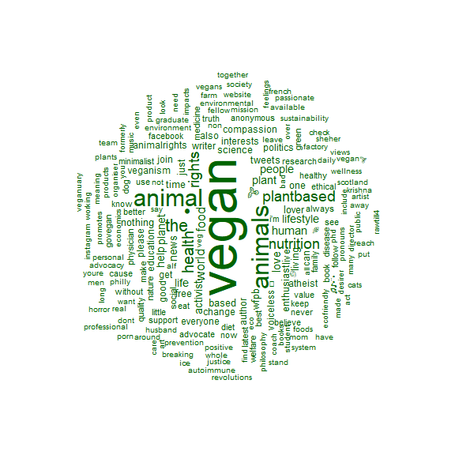
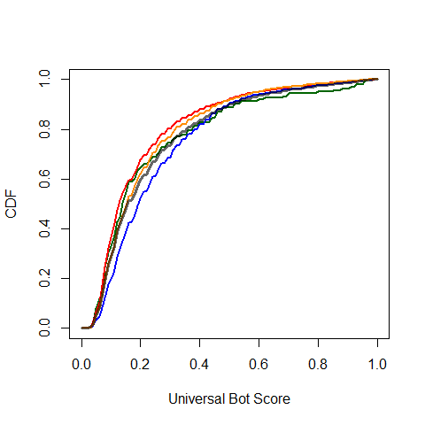
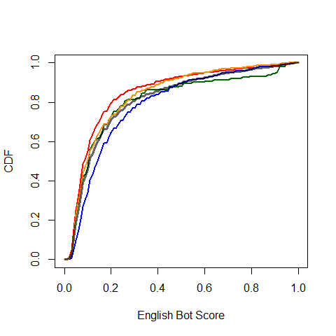

    Sys.setlocale("LC_ALL", 'en_US.UTF-8')

    ## Warning in Sys.setlocale("LC_ALL", "en_US.UTF-8"): OS meldet: Anfrage
    ## Lokalisierung auf "en_US.UTF-8" zu setzen kann nicht beachtet werden

    library(dplyr)
    library(knitr)
    library(kableExtra)
    library(ggplot2)
    library(wordcloud)
    library(tm)

    knitr::opts_chunk$set(
      echo = FALSE,
      message = FALSE,
      warning = FALSE,
      collapse = TRUE,
      comment = "#>"
    )

    load("data/biofreqs.rda")
    load("data/timelinefreqs.rda")

    wordcloud(words=biofreqs$words[biofreqs$community=="blue"], freq = biofreqs$freq[biofreqs$community=="blue"], min.freq = 1,
              max.words=200, random.order=FALSE, rot.per=0.35, 
              colors="blue")

    wordcloud(words=biofreqs$words[biofreqs$community=="red"], freq = biofreqs$freq[biofreqs$community=="red"], min.freq = 1,
              max.words=200, random.order=FALSE, rot.per=0.35, 
              colors="red")

    wordcloud(words=biofreqs$words[biofreqs$community=="yellow"], freq = biofreqs$freq[biofreqs$community=="yellow"], min.freq = 1,
              max.words=200, random.order=FALSE, rot.per=0.35, 
              colors="darkorange")

    wordcloud(words=biofreqs$words[biofreqs$community=="green"], freq = biofreqs$freq[biofreqs$community=="green"], min.freq = 1,
              max.words=200, random.order=FALSE, rot.per=0.35, 
              colors="darkgreen")

    d <- timelinefreqs[timelinefreqs$community=="blue",]
    vs <- paste(d$word[1:12], " (", d$freq[1:12], ")", sep="")
    tabledf <- data.frame(rank=seq(1,12), blue=vs)

    d <- timelinefreqs[timelinefreqs$community=="yellow",]
    tabledf$yellow <- paste(d$word[1:12], " (", d$freq[1:12], ")", sep="")

    d <- timelinefreqs[timelinefreqs$community=="red",]
    tabledf$red <- paste(d$word[1:12], " (", d$freq[1:12], ")", sep="")

    d <- timelinefreqs[timelinefreqs$community=="green",]
    tabledf$green <- paste(d$word[1:12], " (", d$freq[1:12], ")", sep="")

    kable(tabledf, caption="Most frequent words in timelines by community.", col.names = c("Rank", "Blue community", "Yellow community", "Red community", "Green community")) %>%
      kable_styling(full_width = F)

<table class="table" style="width: auto !important; margin-left: auto; margin-right: auto;">
<caption>
Most frequent words in timelines by community.
</caption>
<thead>
<tr>
<th style="text-align:right;">
Rank
</th>
<th style="text-align:left;">
Blue community
</th>
<th style="text-align:left;">
Yellow community
</th>
<th style="text-align:left;">
Red community
</th>
<th style="text-align:left;">
Green community
</th>
</tr>
</thead>
<tbody>
<tr>
<td style="text-align:right;">
1
</td>
<td style="text-align:left;">
food (162302)
</td>
<td style="text-align:left;">
food (112438)
</td>
<td style="text-align:left;">
just (159274)
</td>
<td style="text-align:left;">
vegan (52120)
</td>
</tr>
<tr>
<td style="text-align:right;">
2
</td>
<td style="text-align:left;">
new (138509)
</td>
<td style="text-align:left;">
will (86200)
</td>
<td style="text-align:left;">
like (127010)
</td>
<td style="text-align:left;">
animals (22519)
</td>
</tr>
<tr>
<td style="text-align:right;">
3
</td>
<td style="text-align:left;">
via (114525)
</td>
<td style="text-align:left;">
new (78987)
</td>
<td style="text-align:left;">
people (125573)
</td>
<td style="text-align:left;">
just (21648)
</td>
</tr>
<tr>
<td style="text-align:right;">
4
</td>
<td style="text-align:left;">
health (108360)
</td>
<td style="text-align:left;">
just (76161)
</td>
<td style="text-align:left;">
will (124939)
</td>
<td style="text-align:left;">
people (19750)
</td>
</tr>
<tr>
<td style="text-align:right;">
5
</td>
<td style="text-align:left;">
will (105005)
</td>
<td style="text-align:left;">
one (69199)
</td>
<td style="text-align:left;">
one (120697)
</td>
<td style="text-align:left;">
like (17811)
</td>
</tr>
<tr>
<td style="text-align:right;">
6
</td>
<td style="text-align:left;">
climate (90962)
</td>
<td style="text-align:left;">
great (68317)
</td>
<td style="text-align:left;">
get (103570)
</td>
<td style="text-align:left;">
animal (16137)
</td>
</tr>
<tr>
<td style="text-align:right;">
7
</td>
<td style="text-align:left;">
people (78960)
</td>
<td style="text-align:left;">
good (61810)
</td>
<td style="text-align:left;">
diet (94482)
</td>
<td style="text-align:left;">
one (15493)
</td>
</tr>
<tr>
<td style="text-align:right;">
8
</td>
<td style="text-align:left;">
now (70427)
</td>
<td style="text-align:left;">
like (60330)
</td>
<td style="text-align:left;">
good (92568)
</td>
<td style="text-align:left;">
will (15247)
</td>
</tr>
<tr>
<td style="text-align:right;">
9
</td>
<td style="text-align:left;">
great (67888)
</td>
<td style="text-align:left;">
get (59788)
</td>
<td style="text-align:left;">
now (89198)
</td>
<td style="text-align:left;">
meat (15113)
</td>
</tr>
<tr>
<td style="text-align:right;">
10
</td>
<td style="text-align:left;">
change (65407)
</td>
<td style="text-align:left;">
people (59423)
</td>
<td style="text-align:left;">
time (85244)
</td>
<td style="text-align:left;">
get (12601)
</td>
</tr>
<tr>
<td style="text-align:right;">
11
</td>
<td style="text-align:left;">
world (65261)
</td>
<td style="text-align:left;">
now (59361)
</td>
<td style="text-align:left;">
new (79521)
</td>
<td style="text-align:left;">
food (11967)
</td>
</tr>
<tr>
<td style="text-align:right;">
12
</td>
<td style="text-align:left;">
today (65029)
</td>
<td style="text-align:left;">
today (53789)
</td>
<td style="text-align:left;">
health (79338)
</td>
<td style="text-align:left;">
know (10849)
</td>
</tr>
</tbody>
</table>

    load("data/FollowerComm.rda")
    names(FollowerComm) <- c("CommFrom", "CommTo")
    tabledf <- NULL

    for (comm in c("blue", "yellow", "red", "green"))
    {
      N <- sum(FollowerComm$CommFrom==comm)
      toblue <- sum(FollowerComm$CommFrom==comm & FollowerComm$CommTo=="blue")
      toyellow <- sum(FollowerComm$CommFrom==comm & FollowerComm$CommTo=="yellow")
      tored <- sum(FollowerComm$CommFrom==comm & FollowerComm$CommTo=="red")
      togreen <- sum(FollowerComm$CommFrom==comm & FollowerComm$CommTo=="green")
      tabledf <- rbind(tabledf, data.frame(community=comm, 
                          toblue/N, toyellow/N, tored/N, togreen/N))
    }

    kable(tabledf, caption="Fractions of follower links between communities", col.names = c("From community", "to blue", "to yellow", "to red", "to green")) %>%
      kable_styling(full_width = F)

<table class="table" style="width: auto !important; margin-left: auto; margin-right: auto;">
<caption>
Fractions of follower links between communities
</caption>
<thead>
<tr>
<th style="text-align:left;">
From community
</th>
<th style="text-align:right;">
to blue
</th>
<th style="text-align:right;">
to yellow
</th>
<th style="text-align:right;">
to red
</th>
<th style="text-align:right;">
to green
</th>
</tr>
</thead>
<tbody>
<tr>
<td style="text-align:left;">
blue
</td>
<td style="text-align:right;">
0.8310867
</td>
<td style="text-align:right;">
0.1262394
</td>
<td style="text-align:right;">
0.0330848
</td>
<td style="text-align:right;">
0.0095891
</td>
</tr>
<tr>
<td style="text-align:left;">
yellow
</td>
<td style="text-align:right;">
0.2043125
</td>
<td style="text-align:right;">
0.6237018
</td>
<td style="text-align:right;">
0.1651420
</td>
<td style="text-align:right;">
0.0068437
</td>
</tr>
<tr>
<td style="text-align:left;">
red
</td>
<td style="text-align:right;">
0.0233061
</td>
<td style="text-align:right;">
0.0562884
</td>
<td style="text-align:right;">
0.9184117
</td>
<td style="text-align:right;">
0.0019938
</td>
</tr>
<tr>
<td style="text-align:left;">
green
</td>
<td style="text-align:right;">
0.1245858
</td>
<td style="text-align:right;">
0.0753258
</td>
<td style="text-align:right;">
0.0466092
</td>
<td style="text-align:right;">
0.7534791
</td>
</tr>
</tbody>
</table>

    load("data/RT.rda")
    RT %>% filter(ts <1546300800) -> RT
    names(RT) <- c("ts", "CommFrom", "CommTo")
    tabledf <- NULL

    for (comm in c("blue", "yellow", "red", "green"))
    {
      N <- sum(RT$CommFrom==comm)
      toblue <- sum(RT$CommFrom==comm & RT$CommTo=="blue")
      toyellow <- sum(RT$CommFrom==comm & RT$CommTo=="yellow")
      tored <- sum(RT$CommFrom==comm & RT$CommTo=="red")
      togreen <- sum(RT$CommFrom==comm & RT$CommTo=="green")
      tabledf <- rbind(tabledf, data.frame(community=comm, 
                          toblue/N, toyellow/N, tored/N, togreen/N))
    }

    kable(tabledf, caption="Fractions of retweets between communities by the end of 2018", col.names = c("From community", "to blue", "to yellow", "to red", "to green")) %>%
      kable_styling(full_width = F)

<table class="table" style="width: auto !important; margin-left: auto; margin-right: auto;">
<caption>
Fractions of retweets between communities by the end of 2018
</caption>
<thead>
<tr>
<th style="text-align:left;">
From community
</th>
<th style="text-align:right;">
to blue
</th>
<th style="text-align:right;">
to yellow
</th>
<th style="text-align:right;">
to red
</th>
<th style="text-align:right;">
to green
</th>
</tr>
</thead>
<tbody>
<tr>
<td style="text-align:left;">
blue
</td>
<td style="text-align:right;">
0.9354380
</td>
<td style="text-align:right;">
0.0504908
</td>
<td style="text-align:right;">
0.0083122
</td>
<td style="text-align:right;">
0.0056425
</td>
</tr>
<tr>
<td style="text-align:left;">
yellow
</td>
<td style="text-align:right;">
0.1011083
</td>
<td style="text-align:right;">
0.7949436
</td>
<td style="text-align:right;">
0.1021141
</td>
<td style="text-align:right;">
0.0017749
</td>
</tr>
<tr>
<td style="text-align:left;">
red
</td>
<td style="text-align:right;">
0.0096178
</td>
<td style="text-align:right;">
0.0344577
</td>
<td style="text-align:right;">
0.9552785
</td>
<td style="text-align:right;">
0.0005976
</td>
</tr>
<tr>
<td style="text-align:left;">
green
</td>
<td style="text-align:right;">
0.0626278
</td>
<td style="text-align:right;">
0.0356811
</td>
<td style="text-align:right;">
0.0057610
</td>
<td style="text-align:right;">
0.8959301
</td>
</tr>
</tbody>
</table>

    load("data/RT.rda")
    RT %>% filter(ts>=1547683200 & ts <1548547200) -> RT
    names(RT) <- c("ts", "CommFrom", "CommTo")
    tabledf <- NULL

    for (comm in c("blue", "yellow", "red", "green"))
    {
      N <- sum(RT$CommFrom==comm)
      toblue <- sum(RT$CommFrom==comm & RT$CommTo=="blue")
      toyellow <- sum(RT$CommFrom==comm & RT$CommTo=="yellow")
      tored <- sum(RT$CommFrom==comm & RT$CommTo=="red")
      togreen <- sum(RT$CommFrom==comm & RT$CommTo=="green")
      tabledf <- rbind(tabledf, data.frame(community=comm, 
                          toblue/N, toyellow/N, tored/N, togreen/N))
    }

    kable(tabledf, caption="Fractions of retweets between communities during the ten days after the report release", col.names = c("From community", "to blue", "to yellow", "to red", "to green")) %>%
      kable_styling(full_width = F)

<table class="table" style="width: auto !important; margin-left: auto; margin-right: auto;">
<caption>
Fractions of retweets between communities during the ten days after the
report release
</caption>
<thead>
<tr>
<th style="text-align:left;">
From community
</th>
<th style="text-align:right;">
to blue
</th>
<th style="text-align:right;">
to yellow
</th>
<th style="text-align:right;">
to red
</th>
<th style="text-align:right;">
to green
</th>
</tr>
</thead>
<tbody>
<tr>
<td style="text-align:left;">
blue
</td>
<td style="text-align:right;">
0.9155587
</td>
<td style="text-align:right;">
0.0535393
</td>
<td style="text-align:right;">
0.0208408
</td>
<td style="text-align:right;">
0.0097018
</td>
</tr>
<tr>
<td style="text-align:left;">
yellow
</td>
<td style="text-align:right;">
0.0452489
</td>
<td style="text-align:right;">
0.6770362
</td>
<td style="text-align:right;">
0.2763009
</td>
<td style="text-align:right;">
0.0008484
</td>
</tr>
<tr>
<td style="text-align:left;">
red
</td>
<td style="text-align:right;">
0.0041008
</td>
<td style="text-align:right;">
0.1074958
</td>
<td style="text-align:right;">
0.8879328
</td>
<td style="text-align:right;">
0.0002017
</td>
</tr>
<tr>
<td style="text-align:left;">
green
</td>
<td style="text-align:right;">
0.0711462
</td>
<td style="text-align:right;">
0.0237154
</td>
<td style="text-align:right;">
0.0039526
</td>
<td style="text-align:right;">
0.9011858
</td>
</tr>
</tbody>
</table>

    load("data/communitydf.rda")
    load("data/eatlancet_tweets.rda")

    rtdf <- inner_join(eatlancet_tweets, communitydf, by=c("USER_id_str" = "v_name"))

    tabledf <- NULL

    for (comm in c("blue", "yellow", "red", "green"))
    {
      Nusers <- sum(communitydf$community==comm)
      nRT <- sum(rtdf$retweet_count[rtdf$community==comm])
      mnRT <- nRT/Nusers
      tabledf <- rbind(tabledf, data.frame(community=comm, users=Nusers, retweets=nRT, retweetsperuser=mnRT))
    }

    kable(tabledf, caption="Retweet statistics per community", col.names = c("Community", "Number of users", "Total retweets", "Retweets per user")) %>%
      kable_styling(full_width = F)

<table class="table" style="width: auto !important; margin-left: auto; margin-right: auto;">
<caption>
Retweet statistics per community
</caption>
<thead>
<tr>
<th style="text-align:left;">
Community
</th>
<th style="text-align:right;">
Number of users
</th>
<th style="text-align:right;">
Total retweets
</th>
<th style="text-align:right;">
Retweets per user
</th>
</tr>
</thead>
<tbody>
<tr>
<td style="text-align:left;">
blue
</td>
<td style="text-align:right;">
1255
</td>
<td style="text-align:right;">
12261
</td>
<td style="text-align:right;">
9.769721
</td>
</tr>
<tr>
<td style="text-align:left;">
yellow
</td>
<td style="text-align:right;">
880
</td>
<td style="text-align:right;">
9236
</td>
<td style="text-align:right;">
10.495454
</td>
</tr>
<tr>
<td style="text-align:left;">
red
</td>
<td style="text-align:right;">
1699
</td>
<td style="text-align:right;">
28969
</td>
<td style="text-align:right;">
17.050618
</td>
</tr>
<tr>
<td style="text-align:left;">
green
</td>
<td style="text-align:right;">
164
</td>
<td style="text-align:right;">
4260
</td>
<td style="text-align:right;">
25.975610
</td>
</tr>
</tbody>
</table>

Bot scores:

    load("data/communitydf.rda")
    load("data/eatlancet_botscores.rda")
    inner_join(eatlancet_botscores, communitydf, by=c("USER_id_str"="v_name")) %>%
      select(USER_id_str, universalScore, englishScore, community) -> botcommdf

    cdfGreen <- ecdf(botcommdf$universalScore[botcommdf$community=="green"])
    cdfRed <- ecdf(botcommdf$universalScore[botcommdf$community=="red"])
    cdfBlue <- ecdf(botcommdf$universalScore[botcommdf$community=="blue"])
    cdfYellow <- ecdf(botcommdf$universalScore[botcommdf$community=="yellow"])
    cdfAll <- ecdf(botcommdf$universalScore)

    x <- seq(0,1, by=0.01)
    plot(x, cdfGreen(x), col="darkgreen", type="l", lwd=2, xlab = "Universal Bot Score", ylab = "CDF")
    lines(x, cdfRed(x), col="red", lwd=2)
    lines(x, cdfBlue(x), col="blue", lwd=2)
    lines(x, cdfYellow(x), col="darkorange", lwd=2)
    lines(x, cdfAll(x), col=rgb(0,0,0,0.6),lwd=3)

    cdfGreen <- ecdf(botcommdf$englishScore[botcommdf$community=="green"])
    cdfRed <- ecdf(botcommdf$englishScore[botcommdf$community=="red"])
    cdfBlue <- ecdf(botcommdf$englishScore[botcommdf$community=="blue"])
    cdfYellow <- ecdf(botcommdf$englishScore[botcommdf$community=="yellow"])
    cdfAll <- ecdf(botcommdf$englishScore)

    x <- seq(0,1, by=0.01)
    plot(x, cdfGreen(x), col="darkgreen", type="l", lwd=2, xlab = "English Bot Score", ylab = "CDF")
    lines(x, cdfRed(x), col="red", lwd=2)
    lines(x, cdfBlue(x), col="blue", lwd=2)
    lines(x, cdfYellow(x), col="darkorange", lwd=2)
    lines(x, cdfAll(x), col=rgb(0,0,0,0.6),lwd=3)

    load("data/eatlancet_URLshares.rda")
    eatlancet_URLshares$USER_id_str <- as.character(eatlancet_URLshares$USER_id_str)
    eatlancet_URLshares %>% distinct(id_str, .keep_all = T) -> eatlancet_URLshares

    eatlancet_URLshares <- inner_join(eatlancet_URLshares, eatlancet_botscores, by="USER_id_str")

    cdfRed <- ecdf(eatlancet_URLshares$universalScore[eatlancet_URLshares$class=="Anti"])
    cdfBlue <- ecdf(eatlancet_URLshares$universalScore[eatlancet_URLshares$class=="Pro"])
    cdfGray <- ecdf(eatlancet_URLshares$universalScore[eatlancet_URLshares$class=="Neutral"])

    x <- seq(0,1, by=0.01)
    plot(x, cdfBlue(x), col="blue", type="l", lwd=2, xlab = "Universal Bot Score", ylab = "CDF")
    lines(x, cdfRed(x), col="red", lwd=2)
    lines(x, cdfGray(x), col=rgb(0,0,0,0.6),lwd=2)

    cdfRed <- ecdf(eatlancet_URLshares$englishScore[eatlancet_URLshares$class=="Anti"])
    cdfBlue <- ecdf(eatlancet_URLshares$englishScore[eatlancet_URLshares$class=="Pro"])
    cdfGray <- ecdf(eatlancet_URLshares$englishScore[eatlancet_URLshares$class=="Neutral"])
    legend("bottomright", c("Shares anti EAT-Lancet", "Shares pro EAT-Lancet", 
                            "Shares neutral EAT-Lancet"), col=c("red", "blue", rgb(0,0,0,0.6)), lwd=2)

    x <- seq(0,1, by=0.01)
    plot(x, cdfBlue(x), col="blue", type="l", lwd=2, xlab = "English Bot Score", ylab = "CDF")
    lines(x, cdfRed(x), col="red", lwd=2)
    lines(x, cdfGray(x), col=rgb(0,0,0,0.6),lwd=2)
    legend("bottomright", c("Shares anti EAT-Lancet", "Shares pro EAT-Lancet", 
                            "Shares neutral EAT-Lancet"), col=c("red", "blue", rgb(0,0,0,0.6)), lwd=2)

Potential message reach by community based on follower numbers

    load("data/community_followers.rda")

    community_follower_stats_filtered <- community_followers %>%
      filter(n_tweets > 2) %>%
      group_by(community) %>%
      summarise(n_users = n(),
                sum_tweets = sum(n_tweets),
                sum_followers = sum(n_followers),
                median_followers = median(n_followers),
                mean_followers = mean(n_followers),
                cumulative_tweet_reach = sum(n_followers * n_tweets))

    community_follower_stats_filtered %>%
      select(community, n_users, sum_tweets, median_followers, sum_followers, cumulative_tweet_reach) %>%
      arrange(-n_users) %>%
      kable(format = "html", 
            digits = c(0, 0, 0, 0, 1, 0), 
            col.names = c("Community", "Users (N)", "Tweets (N)", "Followers (median)", "Followers (sum)", "Cumulative reach"))

<table>
<thead>
<tr>
<th style="text-align:left;">
Community
</th>
<th style="text-align:right;">
Users (N)
</th>
<th style="text-align:right;">
Tweets (N)
</th>
<th style="text-align:right;">
Followers (median)
</th>
<th style="text-align:right;">
Followers (sum)
</th>
<th style="text-align:right;">
Cumulative reach
</th>
</tr>
</thead>
<tbody>
<tr>
<td style="text-align:left;">
red
</td>
<td style="text-align:right;">
623
</td>
<td style="text-align:right;">
8034
</td>
<td style="text-align:right;">
270
</td>
<td style="text-align:right;">
1320089
</td>
<td style="text-align:right;">
26112240
</td>
</tr>
<tr>
<td style="text-align:left;">
blue
</td>
<td style="text-align:right;">
184
</td>
<td style="text-align:right;">
1300
</td>
<td style="text-align:right;">
2036
</td>
<td style="text-align:right;">
3453100
</td>
<td style="text-align:right;">
25172644
</td>
</tr>
<tr>
<td style="text-align:left;">
yellow
</td>
<td style="text-align:right;">
146
</td>
<td style="text-align:right;">
1744
</td>
<td style="text-align:right;">
1377
</td>
<td style="text-align:right;">
893636
</td>
<td style="text-align:right;">
9587134
</td>
</tr>
<tr>
<td style="text-align:left;">
green
</td>
<td style="text-align:right;">
40
</td>
<td style="text-align:right;">
338
</td>
<td style="text-align:right;">
1391
</td>
<td style="text-align:right;">
146272
</td>
<td style="text-align:right;">
2339882
</td>
</tr>
</tbody>
</table>
